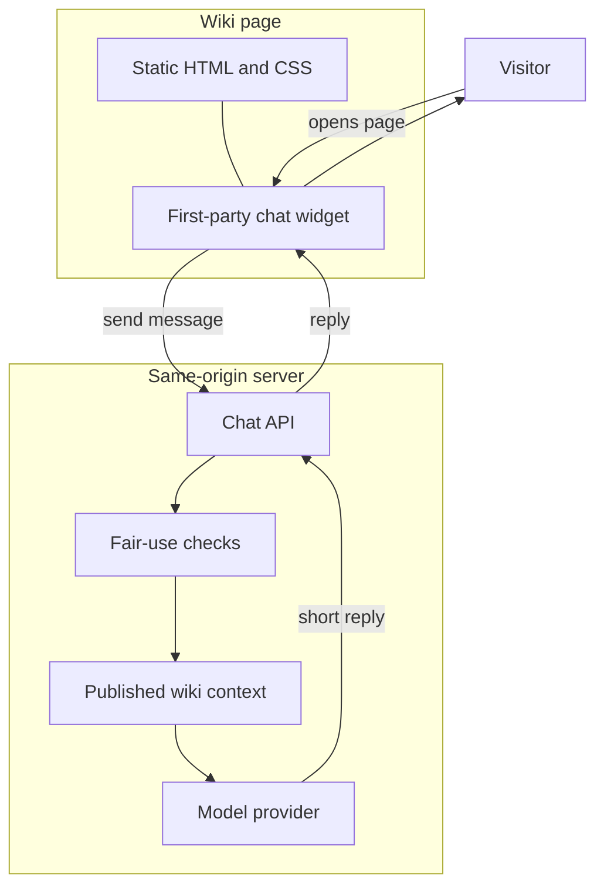

# anush.wiki

Personal wiki at [anush.wiki](https://anush.wiki). Semantic HTML and one stylesheet in `src/`; Next.js hosts a small first-party assistant beside those pages. Model keys stay on the server. Answers stay grounded in what is already published on the site.

## How the assistant works



The widget is UI only. The server decides policy, builds context, and talks to the model.

## Layout

| Path | Role |
|------|------|
| `src/` | Source of truth: landing, blog, CSS, assets, resume |
| `public/` | Generated mirror of `src/` (gitignored) |
| `app/` | App Router and assistant API |
| `lib/` | Server helpers |
| `assistant/` | Chat widget |
| `scripts/` | Sync and verify |
| `specs/` | Design docs |

## Commands

```bash
npm install
npm run dev       # http://127.0.0.1:3000
npm run build
npm run verify
```

Env names: `.env.example`. Process notes: `AGENTS.md`.
