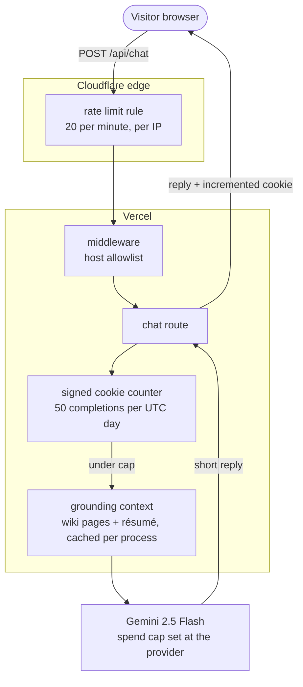
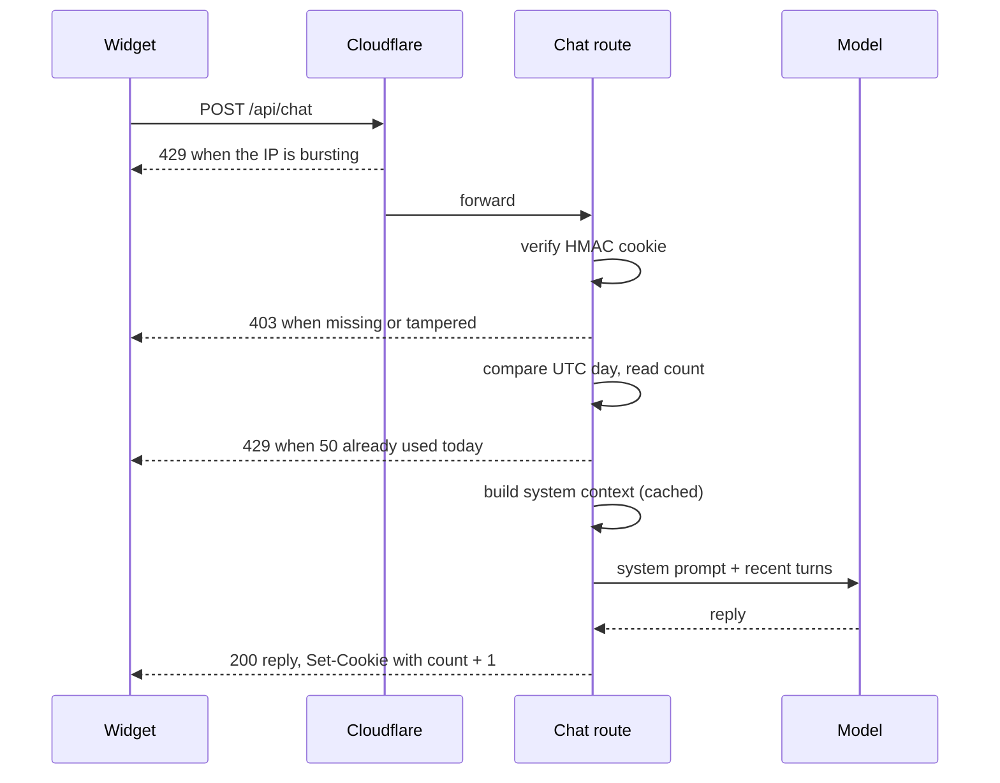

# anush.wiki

Personal wiki at [anush.wiki](https://anush.wiki). Semantic HTML and one stylesheet in `src/`; Next.js hosts a small first-party assistant beside those pages. Model keys stay on the server. Answers stay grounded in what is already published on the site.

## How the assistant works

The widget is UI only. The server decides policy, builds context, and talks to the model. Every control sits on the server or in front of it, so nothing the browser sends is trusted.


```mermaid
flowchart TB
    V([Visitor browser])

    subgraph CF[Cloudflare edge]
        RL[rate limit rule<br/>20 per minute, per IP]
    end

    subgraph VC[Vercel]
        MW[middleware<br/>host allowlist]
        API[chat route]
        Q[signed cookie counter<br/>50 completions per UTC day]
        CTX[grounding context<br/>wiki pages + résumé, cached per process]
    end

    M[Gemini 2.5 Flash<br/>spend cap set at the provider]

    V -->|POST /api/chat| RL
    RL --> MW
    MW --> API
    API --> Q
    Q -->|under cap| CTX
    CTX --> M
    M -->|short reply| API
    API -->|reply + incremented cookie| V
```

Four independent limits, weakest to strongest: the edge rule stops bursts, the host allowlist stops anyone skipping the edge by calling a `*.vercel.app` origin, the cookie counter bounds a normal visitor's day, and the provider spend cap is the ceiling nobody can route around.

### One turn, in order


```mermaid
sequenceDiagram
    participant B as Widget
    participant E as Cloudflare
    participant R as Chat route
    participant M as Model

    B->>E: POST /api/chat
    E-->>B: 429 when the IP is bursting
    E->>R: forward
    R->>R: verify HMAC cookie
    R-->>B: 403 when missing or tampered
    R->>R: compare UTC day, read count
    R-->>B: 429 when 50 already used today
    R->>R: build system context (cached)
    R->>M: system prompt + recent turns
    M-->>R: reply
    R-->>B: 200 reply, Set-Cookie with count + 1
```

Quota is spent by completions only. A 403, a 422, or a model failure never increments the counter, because the cookie is rewritten solely on a successful reply.

### Quota storage

The counter lives in the HMAC-signed `wiki_quota_vid` cookie — visitor id, UTC day, and count, signed with `QUOTA_COOKIE_SECRET`. There is no external store to configure or keep alive.

The tradeoff is deliberate. A visitor can drop the cookie for a fresh bucket or restore an older copy to roll the count back, and concurrent requests all read the same value, so a burst counts once. Bursts are the edge rule's job and the real cost ceiling is the provider spend cap. This is weaker per-visitor than an atomic store and stronger operationally, because it has nothing that can go offline.

## Layout

| Path | Role |
|------|------|
| `src/` | Source of truth: landing, blog, CSS, assets, resume |
| `public/` | Generated mirror of `src/` (gitignored) |
| `app/` | App Router and assistant API |
| `lib/` | Server helpers: quota cookie, published context |
| `assistant/` | Chat widget |
| `middleware.ts` | Canonical redirects and the assistant host allowlist |
| `scripts/` | Sync and verify |
| `specs/` | Design docs |

## Commands

```bash
npm install
npm run dev       # http://127.0.0.1:3000
npm run build
npm run verify
```

Env names: `.env.example`. Process notes: `AGENTS.md`.
